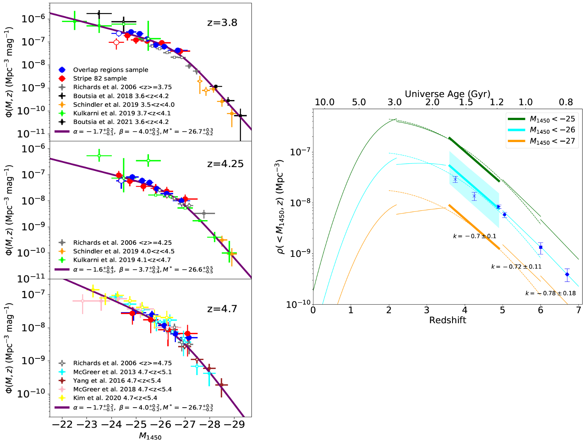

<head>
    
    
</head>



Spatial Density Evolution of Quasars
=====
My research initiative is focused on studying the properties of quasars, in particular the changes in their spatial density over time. The Quasar Luminosity Function (QLF) and the Black Hole Mass Function (BHMF) serve as key mathematical frameworks that illustrate the variation in the spatial distribution of quasars as a function of their luminosity, black hole mass, and redshift. We have completed a significant study of the QLF in the redshift range of 3.5 to 5.0, which bridges previous QLF studies from brighter and deeper surveys, as shown in the figure below. Our results indicate that the cumulative density evolution of quasars from redshifts around 5 to 3.5 is well captured by a pure density evolution model, implying a nearly uniform evolution of the quasar density at $z=3.5-7$ (see ([Pan et al. 2022](https://ui.adsabs.harvard.edu/abs/2022ApJ...928..172P/abstract))).

<figure>
  
  <figcaption>Figure: Quasar luminosity function at 3.5 &lt; z &lt; 5.0 and cumulative density evolution of quasars from z=0 to 7. (Pan et al. 2022)</figcaption>
</figure>

We extend our analysis to include the DESI quasar sample at $1.5<z<3.5$, and combine the results from both datasets for a broader survey spanning $z=1.5$ to 5 (see Yin et al. to be submitted). We aim to increase the redshift resolution of the QLF, derive more accurate redshift of the quasar density peak, and characterize the evolution of the quasar population over a wide range of redshifts and luminosities with small systematic uncertainties. I also contribute to the simulation of the evolutionary pathways for a large sample of BHs growing from their initial seeding at $z≳20$ to $z≃4$, using the observed QLF data ([Li et al. 2024](https://ui.adsabs.harvard.edu/abs/2024ApJ...969...69L/abstract)).

Black Hole Mass Estimation for Quasars
=====
We study on the possible overestimation of single-epoch supermassive black hole (SMBH) masses in previous works, based on more than 55,000 type 1 quasars at $0.25<z<0.8$ from the DESI. We confirm that iron emission strength serves as a good tracer of the Eddington ratio, and thus estimate SMBH masses using an iron-corrected $R-L$ relation for H $\beta$, where $R$ is the broad line region size and $L$ is the continuum luminosity. Compared to our measurements, canonical measurements without the iron correction are overestimated by a factor of 1.5 on average. The overestimation can be up to a factor of 5 for super-Eddington quasars. Using a sample featuring both H $\beta$ and Mg II emission lines, we calibrate Mg II-based SMBH masses using iron-corrected, H $\beta$-based SMBH masses and establish an iron-corrected $R-L$ relation for Mg II. The new relation adds an extra term of $-0.34R_{\mathrm{Fe}}$ to the $R-L$ relation, where $R_{\mathrm{Fe}}$ denotes the relative iron strength. We use this formula to build a catalog of about 0.5 million DESI quasars at $0.6<z<1.6$. If these iron-corrected $R-L$ relations for H $\beta$ and Mg II are valid at high redshift, current mass measurements of luminous quasars at $z\ge6$ would have been overestimated by a factor of 2.3 on average, alleviating the tension between SMBH mass and growth history in the early universe (see Pan et al. submitted to ApJ).

Galaxies in Spectroscopic Surveys 
=====
* Observational tests on fundamental physics: Using a dataset of 110,000 [O III] galaxies from DESI, we have studied changes in the fine-structure constant α. We measured a small α variation, ∆α/α, using the Alkali Doublet method, which may be due to wavelength calibration problems. In addition, using JWST data, we provide the first constraints on ∆α/α at the highest redshifts ($3<z<10$), finding no significant deviation from zero within a 1σ uncertainty of about $10^{-4}$ (see [Jiang, Pan et al. 2024a](https://ui.adsabs.harvard.edu/abs/2024ApJ...968..120J/abstract) and [Jiang et al. 2024b](https://ui.adsabs.harvard.edu/abs/2024arXiv240508977J/abstract)).
* High redshift Lyman-break galaxies (see [Fu et al. 2024](https://ui.adsabs.harvard.edu/abs/2024arXiv240105920F/abstract))

Hunting for Quasars/AGNs
=====
* CSST preparation: quasar forecast from the slitless spectroscopy (see Pan et al. in prep)
* PFS observations for proper motion selected quasar candidates
* Quasars and changing look AGNs in DESI (see [Alexander et al. 2023](https://ui.adsabs.harvard.edu/abs/2023AJ....165..124A/abstract), [Guo et al. 2024](https://ui.adsabs.harvard.edu/abs/2024ApJS..270...26G/abstract), [Juneau et al. 2024](https://ui.adsabs.harvard.edu/abs/2024arXiv240403621J/abstract) and [Guo et al. 2024b](https://ui.adsabs.harvard.edu/abs/2024arXiv240800402G/abstract))
* Quasars/AGNs in JWST (see [Yang et al. 2023](https://ui.adsabs.harvard.edu/abs/2023ApJ...951L...5Y/abstract), [Liu et al. 2024](https://ui.adsabs.harvard.edu/abs/2024arXiv240913189L/abstract) and [Lin et al. 2024](https://ui.adsabs.harvard.edu/abs/2024ApJ...974..147L/abstract))

Physical Properties of Quasars and Galaxies 
=====
* Spectro-photometric decomposition of quasar and host galaxy using HSC images and DESI spectra (see Sun et al. to be submitted)
* SED fitting results for DESI galaxies and AGNs (see [Siudek et al. 2024](https://ui.adsabs.harvard.edu/abs/2024arXiv240919066S/abstract))
